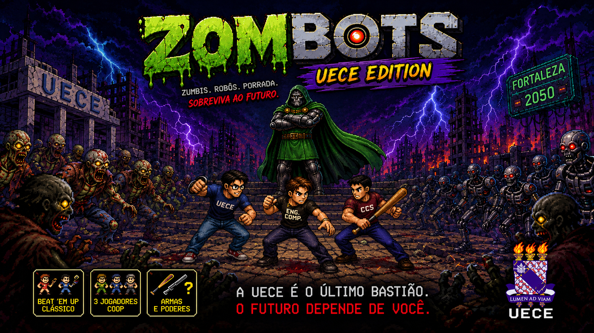
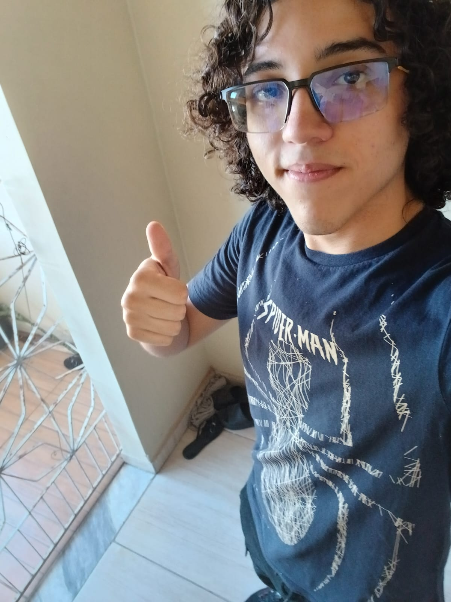

# Zombots — UECE Edition



## Visão Geral

**Zombots — UECE Edition** é um jogo **2D Arcade** no estilo **Beat 'em up**, desenvolvido como trabalho da disciplina de **Computação Gráfica**.

O jogo se passa na **Universidade Estadual do Ceará (UECE)**, que foi invadida por robôs e zumbis. O jogador controla **Apolo**, um viajante do tempo que retorna ao passado para tentar impedir o apocalipse que ele mesmo ajudou a causar.

O projeto também tem como objetivo aplicar conceitos fundamentais de **Computação Gráfica 2D**, com a implementação manual de algoritmos de rasterização, transformações geométricas, preenchimento de regiões, mapeamento de texturas e outros recursos gráficos.

---

## História

### Lore

No passado, **Apolo** cometeu um erro que acabou desencadeando um apocalipse zumbi.

Para tentar reverter a situação, ele desenvolveu robôs com o objetivo de ajudar a população a sobreviver.

Porém, a inteligência artificial dos robôs foi corrompida, e eles passaram a enxergar os humanos como uma ameaça, unindo-se aos zumbis.

A UECE foi rapidamente tomada por **zumbis e robôs hostis**, dando início a um apocalipse ainda pior.

Anos depois, **Apolo do futuro** — que perdeu o braço em um ataque zumbi e hoje carrega um braço mecânico em seu lugar — descobre uma forma de viajar no tempo.

Seu objetivo é retornar ao momento em que tudo começou e impedir que o desastre aconteça.

Porém, a máquina do tempo já vem com uma configuração fixa, que o leva direto para o meio dos acontecimentos dentro da UECE, sem chance de chegar antes e evitar o caos logo no início. Agora, Apolo precisa enfrentar tudo o que acontece na universidade antes que seja tarde demais.

---

## Conceito do Jogo

- **Gênero:** Arcade
- **Estilo:** Beat 'em up
- **Plataforma:** [...]
- **Resolução:** [...]
- **Engine/Bibliotecas:** [...]
- **Linguagem:** [...]
- **Disciplina:** Computação Gráfica

---

## Como Jogar

Para executar o protótipo, com Python e Pygame instalados, rode na raiz do projeto:

```bash
python3 main.py
```

O jogador recebe 2 segundos de invencibilidade após cada golpe não letal.
Ao iniciar esse intervalo, o terminal exibe `IFRAMES ACTIVE` uma vez.
Golpes bloqueados não descontam vida nem prolongam a proteção. A duração pode
ser configurada pelo argumento `invincibility_duration` de `Player`, em segundos.
Os inimigos continuam recebendo dano normalmente.

Para executar os testes automatizados:

```bash
python3 -m unittest discover -s tests -v
```

### Objetivo

[...]

O jogador deverá:

- [...]
- [...]
- [...]
- [...]
- [...]

---

## Controles

| Ação | Teclado |
|------|---------|
| Mover para cima | `[...]` |
| Mover para baixo | `[...]` |
| Mover para esquerda | `[...]` |
| Mover para direita | `[...]` |
| Ataque | `[...]` |
| Ataque especial | `[...]` |
| Interagir | `[...]` |
| Pausar | `[...]` |
| Sair | `[...]` |

---

## HUD

- ❤️ **Vida:** [...]
- ⚔️ **Pontuação:** [...]
- 💰 **Itens:** [...]
- 🔥 **Combo:** [...]
- ⏱️ **Tempo:** [...]

---

## Elementos do Jogo

| Elemento | Descrição |
|----------|-----------|
| 👨 **Apolo** | Personagem controlado pelo jogador. |
| 🧟 **Zumbi** | [...] |
| 🤖 **Zombot** | [...] |
| 👾 **Boss** | [...] |
| 🏫 **UECE** | Cenário principal do jogo. |
| ❤️ **Vida** | [...] |
| [...] | [...] |

---

# Características do Jogo

## Sistema de Combate

[...]

### Ataques

- Ataque básico: [...]
- Ataque especial: [...]
- Combo: [...]
- [...]

---

## Sistema de Inimigos

Os inimigos possuem diferentes comportamentos e características.

### Zumbis

[...]

### Zombots

[...]

### Chefes

[...]

---

## Sistema de Colisão

[...]

O sistema de colisões é utilizado para:

- Detectar ataques;
- Detectar contato entre personagens;
- Impedir que o jogador atravesse obstáculos;
- Detectar interações;
- [...]

---

## Sistema de Pontuação

[...]

A pontuação é calculada considerando:

- [...]
- [...]
- [...]
- [...]

---

## Sistema de Vida

[...]

O jogador possui **[...] vidas/pontos de vida**.

Ao receber dano:

1. [...]
2. [...]
3. [...]

---

## Animações

O jogo possui diferentes animações para representar as ações dos personagens e eventos do jogo.

### Apolo

- Idle: [...]
- Movimento: [...]
- Ataque: [...]
- Dano: [...]
- Morte: [...]
- [...]

### Zumbis

- Movimento: [...]
- Ataque: [...]
- Dano: [...]
- Morte: [...]
- [...]

### Zombots

- Movimento: [...]
- Ataque: [...]
- Dano: [...]
- Morte: [...]
- [...]

---

## Cenas

O jogo é dividido em diferentes cenas/estados.

| Cena | Descrição |
|------|-----------|
| **Abertura** | [...] |
| **Menu** | [...] |
| **Cutscene** | [...] |
| **Gameplay** | [...] |
| **Game Over** | [...] |
| **Vitória** | [...] |
| **Créditos** | [...] |

---

## Áudio

O jogo possui um sistema de áudio responsável pela reprodução de músicas e efeitos sonoros.

### Música

- Menu: [...]
- Gameplay: [...]
- Boss: [...]
- Vitória: [...]
- Game Over: [...]

### Efeitos Sonoros

- Ataque: [...]
- Dano: [...]
- Morte do inimigo: [...]
- Interação: [...]
- [...]

---

# Implementações Técnicas de Computação Gráfica

## Primitivas de Rasterização

| Algoritmo | Arquivo | Uso no Jogo |
|-----------|---------|-------------|
| Set Pixel | `[...]` | [...] |
| Bresenham — Reta | `[...]` | [...] |
| DDA | `[...]` | [...] |
| Círculo | `[...]` | [...] |
| Elipse | `[...]` | [...] |

---

## Preenchimento de Regiões

| Algoritmo | Arquivo | Uso no Jogo |
|-----------|---------|-------------|
| Flood Fill | `[...]` | [...] |
| Boundary Fill | `[...]` | [...] |
| Scanline Fill | `[...]` | [...] |

---

## Transformações Geométricas 2D

As transformações geométricas são implementadas utilizando **matrizes homogêneas 3×3**.

| Transformação | Arquivo | Uso no Jogo |
|---------------|---------|-------------|
| Translação | `[...]` | [...] |
| Escala | `[...]` | [...] |
| Rotação | `[...]` | [...] |
| Reflexão | `[...]` | [...] |
| Composição de matrizes | `[...]` | [...] |

---

## Window, Viewport e Câmera

| Recurso | Arquivo | Uso no Jogo |
|---------|---------|-------------|
| Window | `[...]` | [...] |
| Viewport | `[...]` | [...] |
| Transformação World → Window | `[...]` | [...] |
| Transformação Window → Viewport | `[...]` | [...] |
| Câmera | `[...]` | [...] |
| Zoom | `[...]` | [...] |

---

## Clipping

| Algoritmo | Arquivo | Uso |
|-----------|---------|-----|
| Cohen-Sutherland | `[...]` | [...] |
| [...] | `[...]` | [...] |

---

# Mapeamento de Texturas

[...]

Os sprites e texturas são carregados e processados como [...]

O processo de renderização utiliza [...]

### Processo

1. [...]
2. [...]
3. [...]
4. [...]

---

# Gradientes

[...]

O projeto utiliza gradientes para [...]

### Tipos de Gradiente

- Gradiente linear: [...]
- Gradiente radial: [...]
- Gradiente por vértice: [...]

---

# Efeitos Visuais

O jogo possui diferentes efeitos visuais implementados através de técnicas de Computação Gráfica.

- [...]
- [...]
- [...]
- [...]
- [...]

---

# Performance e Otimizações

[...]

## Otimizações Implementadas

- [...]
- [...]
- [...]
- [...]
- [...]

---

# Arquitetura do Projeto

O projeto foi organizado separando os algoritmos de Computação Gráfica da lógica específica do jogo.

### `engine/`

Contém as implementações dos algoritmos e ferramentas gráficas reutilizáveis.

### `game/`

Contém a lógica específica do jogo, incluindo personagens, inimigos, combate e cenas.

### `assets/`

Contém os recursos utilizados pelo jogo, como sprites, texturas, fontes e arquivos de áudio.

---

# Estrutura do Projeto

```text
Zombots-UECE-Edition/
│
├── README.md
├── requirements.txt
│
├── assets/
│   ├── audio/
│   │   ├── music/
│   │   └── sfx/
│   │
│   ├── sprites/
│   │   ├── player/
│   │   ├── enemies/
│   │   ├── boss/
│   │   ├── environment/
│   │   └── ...
│   │
│   ├── textures/
│   ├── fonts/
│   └── readme/
│       ├── intro.png
│       └── menu_cover.png
│
└── src/
    ├── main.py
    │
    ├── config/
    │   ├── [...]
    │   └── [...]
    │
    ├── engine/
    │   ├── raster/
    │   ├── geometry/
    │   ├── fill/
    │   ├── render/
    │   ├── transformations/
    │   ├── clipping/
    │   └── [...]
    │
    ├── game/
    │   ├── player/
    │   ├── enemies/
    │   ├── combat/
    │   ├── scenes/
    │   ├── audio/
    │   ├── map/
    │   └── [...]
    │
    └── loader/
        ├── [...]
        └── [...]

```
<h2 align="center">Project Contributors</h2>
<table align="center">
  <tr>
    <td align="center">
      <br>
      <b>Gabriel Marques</b>
    </td>
    <td align="center">
      <br>
      <b>Davi Jannsen</b>
    </td>
    <td align="center">
      <br>
      <b>Apolo</b>
    </td>
  </tr>
</table>
