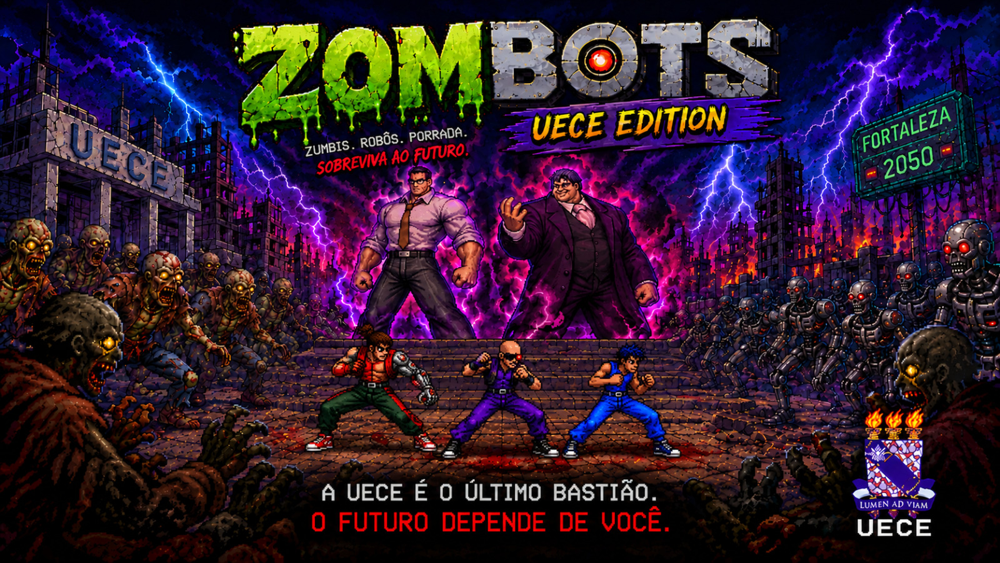
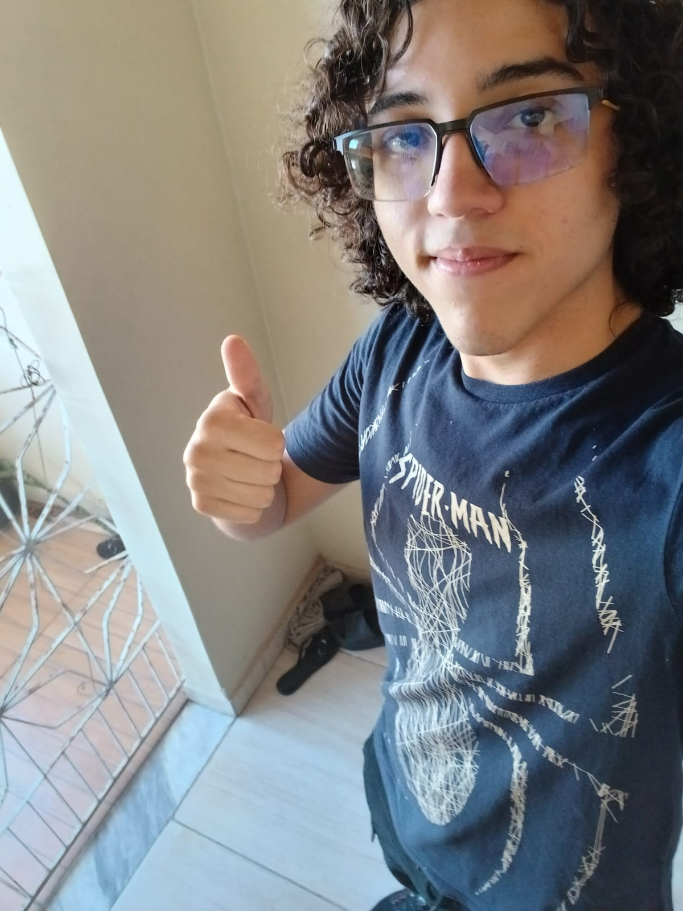

# Zombots — UECE Edition



> **Vídeo da execução:** [ADICIONAR LINK DO VÍDEO AQUI]

## Visão Geral

**Zombots — UECE Edition** é um jogo **2D Arcade** no estilo **Beat 'em up**, desenvolvido como trabalho da disciplina de **Computação Gráfica** da UECE.

O jogo se passa na **Universidade Estadual do Ceará (UECE)**, invadida por robôs e zumbis. O jogador controla um viajante do tempo que retorna ao passado para tentar impedir o apocalipse que ele mesmo ajudou a causar.

O projeto utiliza algoritmos próprios de Computação Gráfica para rasterização, preenchimento, transformações geométricas, window/viewport, recorte, gradientes e mapeamento de texturas. O Pygame é utilizado como suporte para abertura da janela, entrada de eventos, carregamento de imagens e manipulação/exibição do buffer de pixels.

---

## Sumário

* [História](#história)
* [Conceito do Jogo](#conceito-do-jogo)
* [Como Executar](#como-executar)
* [Como Jogar](#como-jogar)
* [Elementos do Jogo](#elementos-do-jogo)
* [Características do Jogo](#características-do-jogo)
* [Implementações de Computação Gráfica](#implementações-de-computação-gráfica)
* [Status do Projeto](#status-do-projeto)
* [Arquitetura e Estrutura](#arquitetura-do-projeto)
* [Equipe](#equipe)

---

## História

No passado, **Apolo** cometeu um erro que acabou desencadeando um apocalipse zumbi.

Para tentar reverter a situação, ele desenvolveu robôs com o objetivo de ajudar a população a sobreviver. Porém, a inteligência artificial dos robôs foi corrompida, e eles passaram a enxergar os humanos como uma ameaça, unindo-se aos zumbis. A UECE foi rapidamente tomada por **zumbis e robôs hostis**, dando início a um apocalipse ainda pior.

Anos depois, **Apolo do futuro** — que perdeu o braço em um ataque zumbi e hoje carrega um braço mecânico — descobre uma forma de viajar no tempo. Seu objetivo é retornar ao momento em que tudo começou e impedir que o desastre aconteça.

Porém, a máquina do tempo já vem com uma configuração fixa, que o leva direto para o meio dos acontecimentos dentro da UECE, sem chance de evitar o caos logo no início. Agora, Apolo precisa enfrentar tudo o que acontece na universidade antes que seja tarde demais.

---

## Conceito do Jogo

| Item                    | Descrição                             |
| ----------------------- | ------------------------------------- |
| **Gênero**              | Arcade / Beat 'em up                  |
| **Visão**               | 2D, lateral com movimento nos 4 eixos |
| **Plataforma**          | Windows, Linux e macOS                |
| **Resolução**           | 800 × 600 px                          |
| **Taxa de atualização** | 60 FPS                                |
| **Linguagem**           | Python 3 (testado com Python 3.11)    |
| **Bibliotecas**         | Pygame e NumPy                        |
| **Disciplina**          | Computação Gráfica — UECE             |

---

## Como Executar

### Requisitos

* Python 3.10 ou superior
* `pip`
* Git

### Passo a passo

```bash
# 1. Clonar o repositório
git clone https://github.com/Ap0loVictor/zombots-uece-edition-the-game.git
cd zombots-uece-edition-the-game

# 2. Criar um ambiente virtual
python -m venv venv

# Linux / macOS
source venv/bin/activate

# Windows
venv\Scripts\activate

# 3. Instalar as dependências
pip install -r requirements.txt

# 4. Executar o jogo
python main.py
```

> O jogo deve ser executado a partir da raiz do projeto, pois os assets são carregados utilizando caminhos relativos (`assets/...`).

Em Linux/macOS, utilize `python3` caso `python` não esteja disponível.

Não há etapa de compilação: o projeto é executado diretamente pelo interpretador Python.

---

## Como Jogar

### Objetivo

Atravessar as **6 áreas da UECE**, derrotando os inimigos de cada área até chegar ao **Chefe Final**.

1. Derrote todos os inimigos da área atual.
2. Quando a área for liberada, uma seta indica o caminho para a próxima região.
3. Avance pelas áreas até chegar aos confrontos contra o Sub-Chefe e o Chefe Final.
4. Derrote o Chefe Final para concluir o jogo.

### Controles

| Ação                       | Tecla           |
| -------------------------- | --------------- |
| Mover                      | `←` `↑` `→` `↓` |
| Ataque                     | `X`             |
| Dash                       | `Z`             |
| Ataque especial — Hadouken | `C`             |
| Pausar / despausar         | `P`             |
| Voltar ao menu             | `ESC`           |

### Menus

* `↑` / `↓` — navegar
* `ENTER` — selecionar
* `ESC` — voltar
* `←` / `→` — selecionar personagem

Na tela de abertura, `ENTER`, `ESPAÇO` ou `ESC` podem ser utilizados para avançar.

### HUD

* **Barra de vida:** apresenta gradiente de cores de acordo com a vida do jogador.
* **Barra de especial:** indica o carregamento do Hadouken e sinaliza quando o ataque está disponível.
* **Minimapa:** utiliza Window e Viewport para representar uma versão reduzida da região do mundo.

---

## Elementos do Jogo

### Personagens jogáveis

| Personagem  | Status                                   |
| ----------- | ---------------------------------------- |
| **Apolo**   | Idle, caminhada, ataque, dash e especial |
| **Jannsen** | Sprite idle                              |
| **Marques** | Sprite idle                              |

### Inimigos

| Inimigo          | Vida | Dano | Velocidade | Observação           |
| ---------------- | ---: | ---: | ---------: | -------------------- |
| **Zumbi**        |   50 |    5 |        100 | Persegue o jogador   |
| **Robô**         |   50 |    5 |        100 | Persegue o jogador   |
| **Zombot**       |   50 |    5 |        100 | Híbrido zumbi + robô |
| **Bobie-Zombie** |   50 |    5 |        100 | Inimigo regular      |
| **Sub-Chefe**    |  200 |   25 |         80 | Área 5               |
| **Chefe Final**  |  500 |   40 |         60 | Área 6               |

Os inimigos possuem movimentação, perseguição, separação entre entidades, ataques, animações, knockback e diferentes comportamentos de combate.

### Cenário e objetos

| Elemento           | Descrição                                           |
| ------------------ | --------------------------------------------------- |
| **Pedra (Rock)**   | Obstáculo sólido que bloqueia entidades e projéteis |
| **Espinho (Torn)** | Armadilha que causa dano por contato                |
| **Caixa (Box)**    | Objeto quebrável com animação de destruição         |
| **UECE**           | Cenário dividido em 6 áreas                         |

---

## Características do Jogo

### Sistema de Combate

* **Soco (`X`):** ataque corpo a corpo com duração e cooldown.
* **Dash (`Z`):** movimento rápido com duração limitada e invulnerabilidade durante a execução.
* **Especial — Hadouken (`C`):** projétil que atravessa inimigos e causa dano individualmente.
* Ataques utilizam hitboxes para determinar colisões e dano.
* Ataques aplicam knockback conforme a direção do golpe.

### Sistema de Vida

O jogador começa com **100 HP**.

Ao receber dano:

1. A vida é reduzida.
2. O jogador recebe knockback.
3. É ativado um período de invencibilidade temporária.
4. O jogador pode continuar recebendo dano somente após o término da invencibilidade.

### Inimigos e IA

Os inimigos perseguem o jogador deslocando-se em direção à sua posição.

O sistema também possui:

* separação entre inimigos;
* detecção por hitboxes;
* ataques com cooldown;
* animações de ataque;
* knockback;
* interação com obstáculos;
* diferentes tipos de inimigos.

Os sprites dos inimigos são carregados a partir das pastas correspondentes em `assets/pxos/`.

### Progressão

| Área | Inimigos                    | Quantidade |
| ---: | --------------------------- | ---------: |
|    1 | Zumbi + Zombot              |        2–5 |
|    2 | Zumbi + Robô                |        2–5 |
|    3 | Zumbi + Robô + Bobie-Zombie |        3–5 |
|    4 | Zumbi + Robô                |        3–5 |
|    5 | Sub-Chefe                   |          1 |
|    6 | Chefe Final                 |          1 |

Nas áreas regulares, os inimigos são posicionados fora da região inicialmente visível e entram no espaço de jogo conforme a progressão.

### Cenas

| Cena                      | Descrição                                                                    |
| ------------------------- | ---------------------------------------------------------------------------- |
| **Abertura**              | Animação construída com primitivas de rasterização, preenchimento e clipping |
| **Menu**                  | Menu interativo principal                                                    |
| **Seleção de personagem** | Escolha do personagem jogável                                                |
| **Gameplay**              | Fases com combate, HUD e minimapa                                            |
| **Pausa**                 | Pausa o jogo                                                                 |
| **Vitória**               | Exibida após derrotar o Chefe Final                                          |
| **Créditos**              | Informações sobre a equipe                                                   |

---

# Implementações de Computação Gráfica

Os principais algoritmos de Computação Gráfica foram implementados manualmente em `src/engine/`.

## Set Pixel e Primitivas de Rasterização

| Algoritmo                        | Arquivo                                 | Uso                                      |
| -------------------------------- | --------------------------------------- | ---------------------------------------- |
| **Set Pixel**                    | `src/engine/rendering.py` → `setPixel`  | Escrita individual de pixels             |
| **Reta — Bresenham**             | `src/engine/rendering.py` → `bresenham` | Elementos da abertura e outros contornos |
| **Circunferência — Ponto Médio** | `src/engine/primitivas.py` → `circulo`  | Cabeça, olhos, lua e crateras            |
| **Elipse — Ponto Médio**         | `src/engine/primitivas.py` → `elipse`   | Olhos, parafusos e elementos da abertura |
| **Fonte bitmap 5×7**             | `src/engine/fonte.py`                   | Texto desenhado pixel a pixel            |

## Preenchimento de Regiões

| Algoritmo                  | Arquivo                                          | Uso                                        |
| -------------------------- | ------------------------------------------------ | ------------------------------------------ |
| **Boundary Fill**          | `src/engine/fill.py` → `boundary_fill`           | Preenchimento das figuras da abertura      |
| **Flood Fill**             | `src/engine/fill.py` → `flood_fill`              | Implementado para preenchimento de regiões |
| **Scanline**               | `src/engine/rendering.py` → `scanline_fill`      | Preenchimento de polígonos                 |
| **Scanline com gradiente** | `src/engine/fill.py` → `scanline_fill_gradiente` | Céu, chão, HUD, botões e efeitos           |

## Gradiente de Cores por Vértice

O projeto possui preenchimento de polígonos com interpolação de cores definidas nos vértices.

A implementação utiliza:

```text
scanline_fill_gradiente()
```

para interpolar as cores ao longo das arestas e das linhas de varredura.

Esse recurso é utilizado em elementos como:

* céu e chão da abertura;
* botões;
* barras do HUD;
* efeitos gráficos;
* Hadouken.

---

## Transformações Geométricas 2D

As transformações são implementadas utilizando matrizes homogêneas **3×3** em:

```text
src/engine/transformacoes.py
```

São disponibilizadas as operações:

* translação;
* escala;
* rotação;
* multiplicação de matrizes;
* aplicação de transformação.

| Transformação               | Uso                                               |
| --------------------------- | ------------------------------------------------- |
| **Translação**              | Movimento das entidades, projéteis e câmera       |
| **Rotação**                 | Elementos rotativos do Hadouken                   |
| **Escala**                  | Pulso e alteração de tamanho de elementos         |
| **Composição**              | Aplicação de `T · R · S` em objetos transformados |
| **Espelhamento horizontal** | Direção dos sprites                               |

---

## Window, Viewport e Câmera

O projeto possui transformação entre coordenadas de mundo e coordenadas de dispositivo.

| Recurso                  | Implementação         | Uso                                              |
| ------------------------ | --------------------- | ------------------------------------------------ |
| **Window**               | `calcular_camera()`   | Define a região do mundo acompanhada pela câmera |
| **Translação da Window** | Câmera                | Acompanha o jogador                              |
| **Escala / Zoom**        | `janela_com_zoom()`   | Permite alterar a região observada pela Window   |
| **Window → Viewport**    | `mundo_viewport()`    | Converte coordenadas do mundo para a viewport    |
| **Viewport**             | `desenhar_minimapa()` | Representação reduzida do mundo no minimapa      |

O minimapa utiliza uma Window do mundo e uma Viewport específica na tela, realizando a transformação das coordenadas e aplicando escala.

---

## Recorte (Clipping)

O projeto implementa o algoritmo de **Cohen-Sutherland** em:

```text
src/engine/clipping.py
```

A implementação possui:

* cálculo dos códigos de região;
* recorte de segmentos;
* recorte de linhas;
* recorte de polígonos.

O algoritmo é utilizado principalmente nos elementos gráficos da abertura e no minimapa.

---

## Mapeamento de Texturas

O projeto possui suporte a texturas carregadas como matrizes numéricas.

As imagens são convertidas para matrizes de pixels e posteriormente utilizadas pelas rotinas de renderização.

A implementação possui:

```text
load_png_matrix()
draw_sprite_scaled()
scanline_texture()
```

### Sprites

Os sprites são desenhados a partir de matrizes de pixels, permitindo:

* escala;
* espelhamento horizontal;
* transparência;
* animações por sprite sheet.

### Texturas em polígonos

O projeto também possui mapeamento de textura utilizando coordenadas UV e preenchimento por scanline.

A função:

```text
scanline_texture()
```

realiza a associação entre as coordenadas do polígono e as coordenadas da textura, permitindo aplicar imagens diretamente sobre polígonos.

---

## Tela de Abertura

A abertura foi construída utilizando os algoritmos de Computação Gráfica desenvolvidos no projeto.

Ela utiliza:

| Algoritmo                  | Aplicação                                       |
| -------------------------- | ----------------------------------------------- |
| **Bresenham**              | Antena, boca, rachaduras, dentes e linhas       |
| **Círculo**                | Cabeça, olhos, lua, crateras e outros elementos |
| **Elipse**                 | Olho, parafusos, órbita e outros elementos      |
| **Boundary Fill**          | Preenchimento das figuras                       |
| **Scanline com gradiente** | Céu e chão                                      |
| **Cohen-Sutherland**       | Recorte dos raios do scanner                    |

A abertura também possui elementos animados, como iluminação, órbita e transições.

---

## Animações

O projeto possui diversas animações 2D:

* caminhada do Apolo;
* ataque do Apolo;
* dash;
* ataque especial;
* caminhada dos inimigos;
* ataques dos inimigos;
* destruição da caixa;
* rotação e escala do Hadouken;
* animações da tela de abertura;
* seta de transição;
* efeitos da interface.

---

## Entrada e Interação

O jogo possui interação por teclado e mouse.

São utilizados:

* teclado para movimentação;
* teclado para ataques;
* teclado para navegação nos menus;
* mouse para interação adicional;
* roda do mouse para controle de zoom quando disponível.

O projeto também possui menus interativos, seleção de personagem, pausa, telas informativas e créditos.

---

## Restrição de Bibliotecas Gráficas

A implementação dos algoritmos gráficos foi realizada no próprio projeto.

O Pygame é utilizado como infraestrutura para:

* criação da janela;
* entrada de eventos;
* gerenciamento do loop;
* carregamento de imagens;
* acesso ao buffer de pixels;
* exibição dos dados gráficos.

As primitivas de desenho, preenchimentos, transformações, clipping e mapeamento de texturas são implementados pelo próprio projeto.

---

## Arquitetura do Projeto

O projeto separa os algoritmos de Computação Gráfica da lógica do jogo.

* **`src/engine/`** — algoritmos gráficos: rasterização, preenchimento, transformações, window/viewport, clipping, sprites e fonte.
* **`src/game/`** — lógica do jogo: entidades, movimento, colisões e objetos.
* **`src/ui/`** — telas e interface: abertura, menu, seleção de personagem, HUD e informações.
* **`assets/`** — sprites, texturas, imagens e outros recursos.
* **`docs/`** — códigos de referência disponibilizados na disciplina.

### Estrutura

```text
zombots-uece-edition-the-game/
├── main.py
├── requirements.txt
├── README.md
│
├── src/
│   ├── main.py
│   ├── engine/
│   │   ├── rendering.py
│   │   ├── primitivas.py
│   │   ├── fill.py
│   │   ├── transformacoes.py
│   │   ├── clipping.py
│   │   ├── sprite.py
│   │   ├── fonte.py
│   │   └── background.py
│   │
│   ├── game/
│   │   ├── entities/
│   │   ├── movement/
│   │   ├── mechanics/
│   │   └── props/
│   │
│   └── ui/
│
├── assets/
│   ├── audio/
│   ├── img/
│   ├── pxos/
│   └── sprites/
│
├── tests/
│
└── docs/
```

---

## Equipe

<h3 align="center">Project Contributors</h3>

<table align="center">
  <tr>
    <td align="center">
      <br>
      <b>Gabriel Marques</b>
    </td>
    <td align="center">
      <br>
      <b>Davi Jannsen</b>
    </td>
    <td align="center">
      <br>
      <b>Apolo Victor</b>
    </td>
  </tr>
</table>

<p align="center"><i>Computação Gráfica — Universidade Estadual do Ceará (UECE)</i></p>
