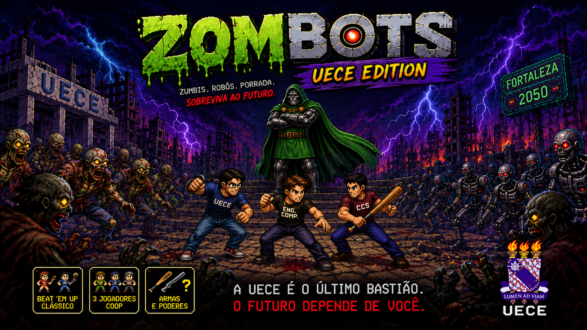

# Zombots — UECE Edition



> 🎥 **Vídeo da execução:** 🚧 _[adicionar link aqui antes da entrega]_

## Visão Geral

**Zombots — UECE Edition** é um jogo **2D Arcade** no estilo **Beat 'em up**, desenvolvido como trabalho da disciplina de **Computação Gráfica** (UECE).

O jogo se passa na **Universidade Estadual do Ceará (UECE)**, invadida por robôs e zumbis. O jogador controla um viajante do tempo que retorna ao passado para tentar impedir o apocalipse que ele mesmo ajudou a causar.

Todo o desenho do jogo é feito **pixel a pixel**: o projeto implementa manualmente os algoritmos de rasterização, preenchimento, transformações geométricas, window/viewport, recorte e mapeamento de texturas. O Pygame é usado apenas para abrir a janela, ler o teclado, carregar arquivos de imagem e exibir o buffer de pixels.

---

## Sumário

- [História](#história)
- [Conceito do Jogo](#conceito-do-jogo)
- [Como Executar](#como-executar)
- [Como Jogar](#como-jogar)
- [Elementos do Jogo](#elementos-do-jogo)
- [Características do Jogo](#características-do-jogo)
- [Implementações de Computação Gráfica](#implementações-de-computação-gráfica)
- [Status do Projeto](#status-do-projeto)
- [Arquitetura e Estrutura](#arquitetura-do-projeto)
- [Equipe](#equipe)

---

## História

No passado, **Apolo** cometeu um erro que acabou desencadeando um apocalipse zumbi.

Para tentar reverter a situação, ele desenvolveu robôs com o objetivo de ajudar a população a sobreviver. Porém, a inteligência artificial dos robôs foi corrompida, e eles passaram a enxergar os humanos como uma ameaça, unindo-se aos zumbis. A UECE foi rapidamente tomada por **zumbis e robôs hostis**, dando início a um apocalipse ainda pior.

Anos depois, **Apolo do futuro** — que perdeu o braço em um ataque zumbi e hoje carrega um braço mecânico — descobre uma forma de viajar no tempo. Seu objetivo é retornar ao momento em que tudo começou e impedir que o desastre aconteça.

Porém, a máquina do tempo já vem com uma configuração fixa, que o leva direto para o meio dos acontecimentos dentro da UECE, sem chance de evitar o caos logo no início. Agora, Apolo precisa enfrentar tudo o que acontece na universidade antes que seja tarde demais.

---

## Conceito do Jogo

| Item | Descrição |
|------|-----------|
| **Gênero** | Arcade / Beat 'em up |
| **Visão** | 2D, lateral com movimento nos 4 eixos (estilo _Streets of Rage_) |
| **Plataforma** | Windows, Linux e macOS |
| **Resolução** | 800 × 600 px, 60 FPS |
| **Linguagem** | Python 3 (testado com 3.11) |
| **Bibliotecas** | [Pygame](https://www.pygame.org/) (janela, eventos, `set_at`, carga de imagens) e [NumPy](https://numpy.org/) (matrizes de pixels dos sprites) |
| **Disciplina** | Computação Gráfica — UECE |

---

## Como Executar

### Requisitos

- [Python 3.10+](https://www.python.org/downloads/) (testado com 3.11)
- `pip`
- Git

### Passo a passo

```bash
# 1. Clonar o repositório
git clone https://github.com/Ap0loVictor/zombots-uece-edition-the-game.git
cd zombots-uece-edition-the-game

# 2. (Recomendado) criar um ambiente virtual
python -m venv venv
source venv/bin/activate        # Linux / macOS
venv\Scripts\activate           # Windows (PowerShell / CMD)

# 3. Instalar as dependências
pip install -r requirements.txt

# 4. Executar o jogo (sempre a partir da raiz do projeto)
python main.py
```

> ⚠️ O jogo deve ser executado **a partir da raiz do repositório**, pois os assets são carregados por caminhos relativos (`assets/...`).
>
> Em Linux/macOS, use `python3` caso `python` não esteja disponível.

Não há etapa de compilação: o projeto é interpretado.

---

## Como Jogar

### Objetivo

Atravessar as **6 áreas** da UECE de ponta a ponta, derrotando todos os inimigos de cada área para liberar o avanço, até **derrotar o Chefe Final**.

1. Derrote todos os inimigos da área atual.
2. Quando a área for liberada, aparece uma **seta amarela** pulsando: siga em frente para a direita.
3. A câmera acompanha o jogador, e **não é possível voltar** para áreas anteriores.
4. Sobreviva às 4 áreas de inimigos comuns, ao **Sub-Chefe** (área 5) e ao **Chefe Final** (área 6).

### Controles

| Ação | Tecla |
|------|-------|
| Mover | `←` `↑` `→` `↓` |
| Ataque (soco) | `X` |
| Dash | `Z` |
| Ataque especial (Hadouken) | `C` _(quando a barra estiver cheia)_ |
| Pausar / despausar | `P` |
| Voltar ao menu | `ESC` |

**Nos menus:** `↑` `↓` navegam, `ENTER` seleciona, `ESC` volta. Na seleção de personagem, use `←` `→`. Na tela de abertura, `ENTER`, `ESPAÇO` ou `ESC` pulam a animação.

### HUD

- **Barra de vida (HP):** gradiente que muda de cor conforme a vida (verde → amarelo → vermelho).
- **Barra de especial:** azul enquanto carrega, dourada e piscando (`C: HADOUKEN!`) quando pronta.
- **Minimapa:** viewport no canto superior direito que mostra uma versão reduzida da janela do mundo.

---

## Elementos do Jogo

### Personagens jogáveis

Escolhidos na tela de seleção:

| Personagem | Status |
|------------|--------|
| 👨 **Apolo** | Completo: idle, caminhada, soco (3 frames), dash (11 frames) e especial |
| 👨 **Jannsen** | 🚧 Apenas sprite idle por enquanto (sprites de animação em produção) |
| 👨 **Marques** | 🚧 Apenas sprite idle por enquanto (sprites de animação em produção) |

### Inimigos

| Inimigo | Vida | Dano por ataque | Velocidade | Observação |
|---------|-----:|----------------:|-----------:|------------|
| 🧟 **Zumbi** | 50 | 5 | 100 | Persegue o jogador |
| 🤖 **Robô** | 50 | 5 | 100 | Persegue o jogador |
| 🧟🤖 **Zombot** | 50 | 5 | 100 | Híbrido zumbi + robô |
| 🧟 **Bobie-Zombie** | 50 | 5 | 100 | Inimigo regular da área 3 |
| 👾 **Sub-Chefe** | 200 | 25 | 80 | Área 5 — 🚧 sprite definitivo pendente |
| 👾 **Chefe Final** | 500 | 40 | 60 | Área 6 — 🚧 sprite definitivo pendente |

### Cenário e objetos

| Elemento | Descrição |
|----------|-----------|
| 🪨 **Pedra (Rock)** | Obstáculo sólido. Bloqueia o jogador, os inimigos e o Hadouken. |
| ⚠️ **Espinho (Torn)** | Armadilha: causa 10 de dano por contato. |
| 📦 **Caixa (Box)** | Quebrável (1 de vida), com animação de destruição de 11 frames. |
| 🏫 **UECE** | Cenário dividido em 6 áreas de 900 px (mundo de 5400 px de largura). |

---

## Características do Jogo

### Sistema de Combate

- **Soco (`X`):** duração de 0,2 s e _cooldown_ de 0,4 s. Causa 25 de dano e aplica _knockback_ na direção do golpe. Cada golpe acerta no máximo um inimigo.
- **Dash (`Z`):** impulso de 0,2 s a 3,5× a velocidade normal, _cooldown_ de 1 s. Durante o dash o jogador é **imune a dano** e atravessa inimigos.
- **Especial — Hadouken (`C`):** projétil que **atravessa inimigos**, ferindo cada um uma vez (40 de dano). A barra leva **10 s** para carregar. É bloqueado por pedras e desaparece ao sair do mundo ou após 2 s.

### Sistema de Vida

O jogador começa com **100 HP**. Ao receber dano de contato (inimigo ou espinho):

1. A vida é reduzida e o inimigo sofre _knockback_;
2. O jogador fica **2 s invencível** (_i-frames_); golpes bloqueados não descontam vida;
3. Com 0 HP o personagem morre. 🚧 _A tela de Game Over ainda será implementada._

### Inimigos e IA

Os inimigos perseguem o jogador deslocando-se em direção à sua posição, com uma força de **separação** que evita que se sobreponham uns aos outros. Ao serem atingidos, sofrem _knockback_ temporário.

`Enemy.try_attack(player)` inicia o ataque somente quando as hitboxes se sobrepõem.
Cada inimigo tem um **cooldown de 1 segundo entre inícios de ataques**, com uma
única tentativa de dano por golpe. A animação dura 0,6 s; durante esse período,
o inimigo para de perseguir, mas ainda pode sofrer knockback. A invencibilidade
e o dash do jogador bloqueiam o dano sem reiniciar a animação nem o cooldown.
Os sprites são carregados das pastas atualizadas em `assets/pxos/`.

### Progressão

| Área | Inimigos | Quantidade |
|-----:|----------|-----------:|
| 1 | Zumbi + Zombot | 2–5 |
| 2 | Zumbi + Robô | 2–5 |
| 3 | Zumbi + Robô + Bobie-Zombie | 3–5 |
| 4 | Zumbi + Robô (maior presença de robôs) | 3–5 |
| 5 | **Sub-Chefe** | 1 |
| 6 | **Chefe Final** | 1 |

Nas áreas 1–4, a quantidade é sorteada ao entrar na fase. Os inimigos surgem
na borda direita (`offset_x + width - Enemy.WIDTH`), com Y aleatório entre
o topo e a última posição que mantém o sprite inteiro na tela. As hitboxes
nascem separadas para evitar travamentos de movimento. A quantidade também
respeita o espaço vertical disponível.

Os limites ficam em `MIN_INIMIGOS_REGULARES` e `MAX_INIMIGOS_REGULARES`, em
`src/main.py`; o mínimo de cada fase preserva sua composição de inimigos.
Sub-chefe e chefe final mantêm suas posições e quantidades fixas.

### Cenas

| Cena | Descrição |
|------|-----------|
| **Abertura** | Animação feita só com retas, círculos e elipses preenchidos. Veja [Tela de Abertura](#tela-de-abertura). |
| **Menu** | START, CONTROLS, CREDITS, SETTINGS (🚧 _em breve_) e EXIT. |
| **Seleção de personagem** | Escolha entre Apolo, Jannsen e Marques. |
| **Gameplay** | Fases em side-scroll com HUD e minimapa. |
| **Pausa** | Congela o jogo (`P`). |
| **Vitória** | Exibida ao derrotar o Chefe Final. |
| **Créditos** | Equipe do projeto. |
| **Game Over** | 🚧 A implementar. |

---

## Implementações de Computação Gráfica

Todos os algoritmos abaixo foram implementados manualmente em `src/engine/`.

### Set Pixel e Primitivas de Rasterização

| Algoritmo | Arquivo | Uso no Jogo |
|-----------|---------|-------------|
| Set Pixel | `src/engine/rendering.py` → `setPixel` | Único ponto de escrita na tela; aplica recorte retangular opcional (`clip_atual`) |
| Reta — Bresenham | `src/engine/rendering.py` → `bresenham` | Contornos de polígonos, antena, boca, raios do scanner |
| Circunferência — Ponto Médio | `src/engine/primitivas.py` → `circulo` | Cabeça, olhos, lua e crateras da abertura |
| Elipse — Ponto Médio (2 regiões) | `src/engine/primitivas.py` → `elipse` | Olho, parafusos, órbita da abertura; cauda do Hadouken |
| Fonte bitmap 5×7 | `src/engine/fonte.py` | Todo o texto do jogo, desenhado com `setPixel` |

### Preenchimento de Regiões

| Algoritmo | Arquivo | Uso no Jogo |
|-----------|---------|-------------|
| Boundary Fill (iterativo, 4-conectado) | `src/engine/fill.py` → `boundary_fill` | Preenche todas as figuras da abertura |
| Flood Fill (iterativo, 4-conectado) | `src/engine/fill.py` → `flood_fill` | Implementado (ainda não usado nas telas atuais) |
| Scanline | `src/engine/rendering.py` → `scanline_fill` | Prédio da abertura, pedras, espinhos, seta de transição |
| Scanline com gradiente por vértice | `src/engine/fill.py` → `scanline_fill_gradiente` | Céu/chão da abertura, botões, barras de HUD, Hadouken |

### Transformações Geométricas 2D

Matrizes homogêneas **3×3** em `src/engine/transformacoes.py`: `translacao`, `escala`, `rotacao`, `multiplica_matrizes` e `aplica_transformacao`.

| Transformação | Uso no Jogo |
|---------------|-------------|
| Translação | Movimento do Hadouken e de todas as entidades; câmera |
| Rotação | Estrelas do Hadouken girando em sentidos opostos |
| Escala | “Pulso” da estrela do Hadouken |
| Composição de matrizes | `T · R · S` aplicada aos vértices do Hadouken (`src/game/entities/Hadouken.py`) |
| Espelhamento horizontal | Sprites virados para a esquerda (`flip_x` em `draw_sprite_scaled`) |

### Window, Viewport e Câmera

| Recurso | Onde | Uso no Jogo |
|---------|------|-------------|
| Window (janela do mundo) | `calcular_camera` em `src/main.py` | Retângulo do mundo visível, que acompanha o jogador (translação) |
| Transformação Window → Viewport | `mundo_viewport`, `transforma_poligono` em `rendering.py` | Mapeia a janela do mundo para a viewport do minimapa (com escala) |
| Viewport | `desenhar_minimapa` em `rendering.py` | Minimapa em (600,20)–(780,160), recortado na própria viewport |
| Zoom | 🚧 | A implementar: aproximar/afastar a window da câmera |

### Recorte (Clipping)

| Algoritmo | Arquivo | Uso |
|-----------|---------|-----|
| Cohen-Sutherland | `src/engine/clipping.py` → `cohen_sutherland`, `desenhar_linha_recortada`, `desenhar_poligono_recortado` | Raios do scanner da abertura e contornos de polígonos do minimapa |

### Mapeamento de Texturas

Os PNGs são carregados em **matrizes NumPy RGBA** (`src/engine/sprite.py` → `load_png_matrix`) e desenhados pixel a pixel com `setPixel` por `draw_sprite_scaled`, que faz **amostragem por vizinho mais próximo** (escala), ignora pixels transparentes e permite espelhamento. _Sprite sheets_ são fatiadas em quadros por `load_sprite_sheet_frames` (usadas no dash do Apolo e na quebra da caixa).

🚧 **A implementar:** textura sobre polígonos arbitrários com coordenadas UV e interpolação por scanline (planejado para os cenários das fases, que já estão em `assets/pxos/Fases/`).

### Tela de Abertura

Construída em `src/ui/Intro.py` com duas camadas: uma camada **estática** (montada uma única vez e guardada em cache) e uma camada **animada** por frame.

| Algoritmo | Aplicação |
|-----------|-----------|
| Bresenham | Antena, boca, rachadura, dentes, linha do horizonte |
| Círculo (Ponto Médio) | Cabeça, olho robô, lua, crateras, luz da antena, satélite |
| Elipse (Ponto Médio) | Olho zumbi, parafusos, órbita elíptica “respirando” ao redor da lua |
| Boundary Fill | Preenchimento de todas as figuras acima |
| Scanline com gradiente | Céu e chão |
| Cohen-Sutherland | Raios que saem do olho robô, recortados na moldura amarela |

### Animações

- **Apolo:** troca de quadros no andar, soco em 3 fases (preparo → extensão → recuo), dash em 11 quadros, pose de lançamento do especial.
- **Zumbi, Robô, Zombot e Bobie-Zombie:** caminhada e ataque em 8 quadros, com espelhamento para a esquerda. Os chefes usam provisoriamente as animações do zumbi.
- **Caixa:** 11 quadros de destruição em 0,5 s.
- **Hadouken:** estrelas giratórias com pulso de escala e cauda de elipses.
- **Interface:** seta de transição pulsante, luz da antena piscando, órbita elíptica na abertura.

### Performance

- Camadas estáticas (fundo da abertura, barras de HUD, menus) são **desenhadas uma vez e mantidas em cache**, sendo refeitas só quando algo muda.
- Menus e telas informativas só redesenham quando há alteração.
- O texto usa listas pré-calculadas dos pixels acesos de cada glifo.

---

## Status do Projeto

| Requisito | Status |
|-----------|:------:|
| Set Pixel | ✅ |
| Reta, círculo e elipse | ✅ |
| Flood Fill / Boundary Fill | ✅ |
| Preenchimento por Scanline | ✅ |
| Gradiente de cor por vértice | ✅ |
| Translação, escala e rotação | ✅ |
| Animação 2D | ✅ |
| Window + viewport (translação e escala) | ✅ (zoom da câmera 🚧) |
| Recorte de Cohen-Sutherland | ✅ |
| Textura de imagens (sprites) | ✅ (textura em polígonos com UV 🚧) |
| Input por teclado | ✅ |
| Menu interativo | ✅ |

**Em desenvolvimento**

- [x] Sprites e animações dos inimigos (zumbi, robô, zombot e Bobie-Zombie)
- [ ] Sprites definitivos dos chefes
- [ ] Sprites de animação de Jannsen e Marques
- [ ] Mapas / cenários das fases (arquivos já em `assets/pxos/Fases/`)
- [ ] Tela de Game Over
- [ ] Zoom da câmera
- [ ] Textura mapeada em polígonos (UV + scanline)
- [ ] Tela de Settings
- [ ] Pontuação, itens e áudio _(opcionais)_

---

## Arquitetura do Projeto

O projeto separa os **algoritmos de Computação Gráfica** (reutilizáveis) da **lógica do jogo**:

- **`src/engine/`** — algoritmos gráficos: rasterização, preenchimento, transformações, window/viewport, recorte, sprites e fonte.
- **`src/game/`** — lógica do jogo: entidades, movimento, colisão (AABB) e props.
- **`src/ui/`** — telas e interface: abertura, menu, seleção de personagem, HUD.
- **`assets/`** — sprites, texturas e imagens.

### Estrutura atual

```text
zombots-uece-edition-the-game/
├── main.py                   # ponto de entrada
├── requirements.txt
├── README.md
│
├── src/
│   ├── main.py               # loop principal, máquina de estados, fases e câmera
│   ├── engine/
│   │   ├── rendering.py      # setPixel, Bresenham, scanline, window→viewport, minimapa
│   │   ├── primitivas.py     # círculo e elipse (ponto médio)
│   │   ├── fill.py           # flood/boundary fill, scanline com gradiente
│   │   ├── transformacoes.py # matrizes 3×3
│   │   ├── clipping.py       # Cohen-Sutherland
│   │   ├── sprite.py         # PNG → matriz NumPy, desenho com escala/flip
│   │   ├── fonte.py          # fonte bitmap 5×7
│   │   └── background.py     # lista dos cenários das fases
│   ├── game/
│   │   ├── entities/         # Entity, Player, Enemy (+bosses), Box, Hadouken
│   │   ├── movement/         # Movement, MovementPlayer, MovementEnemies
│   │   ├── mechanics/        # Physics (colisão AABB, hitboxes)
│   │   └── props/            # Prop, Rock, Torn
│   └── ui/                   # Intro, Menu, Button, CharacterSelect, InfoScreen, BarraVida
│
├── assets/
│   ├── img/                  # imagens do README e dos créditos
│   ├── pxos/                 # sprites e cenários em PNG
│   └── sprites/              # classes de sprite (PixelSprite, polígonos de props)
│
└── docs/                     # códigos de referência da disciplina
```

---

## Equipe

<h3 align="center">Project Contributors</h3>
<table align="center">
  <tr>
    <td align="center">
      <br>
      <b>Gabriel Marques</b>
    </td>
    <td align="center">
      <br>
      <b>Davi Jannsen</b>
    </td>
    <td align="center">
      <br>
      <b>Apolo Victor</b>
    </td>
  </tr>
</table>

<p align="center"><i>Computação Gráfica — Universidade Estadual do Ceará (UECE)</i></p>
